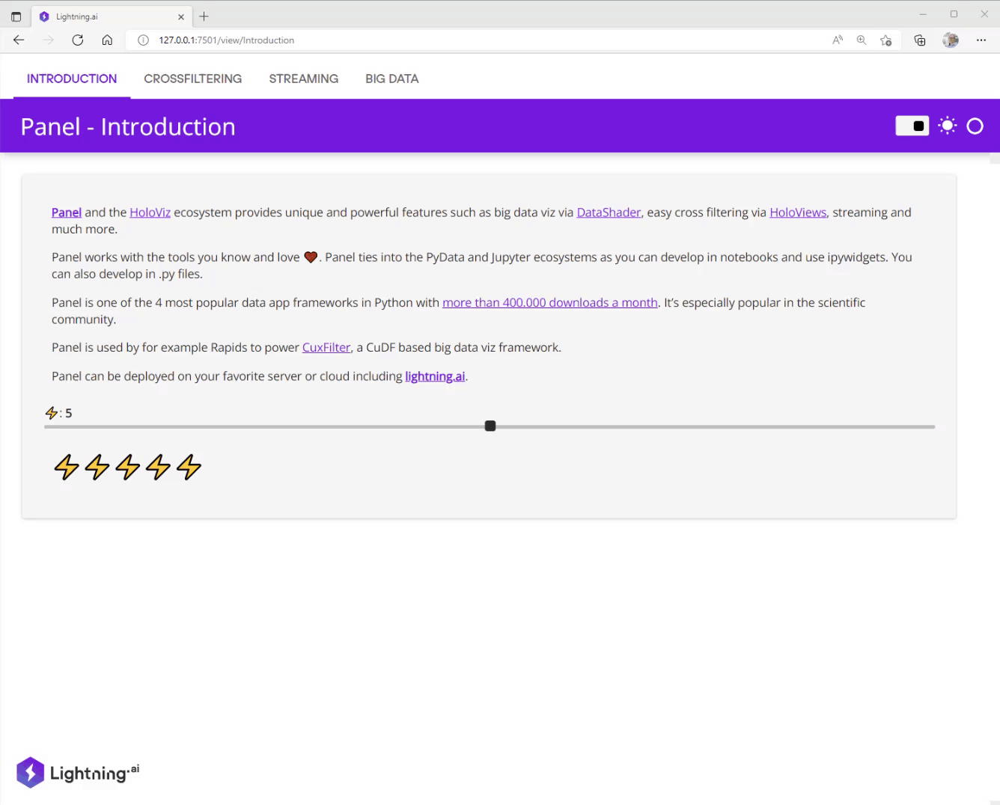

  [](https://twitter.com/MarcSkovMadsen)

# ⚡ Awesome Panel Lightning

Repository demonstrating the power of combining [Panel](https://panel.holoviz.org) and [lightning.ai](https://lightning.ai/) to build, scale and deploy powerful machinelearning and deeplearning data apps.

[](https://01g6g6axybbecmx47d9m419pe5.litng-ai-03.litng.ai/view?id=01g6g6axybbecmx47d9m419pe5)

Check out the live [Example App](https://01g6g6axybbecmx47d9m419pe5.litng-ai-03.litng.ai/view?id=01g6g6axybbecmx47d9m419pe5).

## ⚙️ Install Locally

[Create](https://realpython.com/python-virtual-environments-a-primer/#create-it) and [activate](https://realpython.com/python-virtual-environments-a-primer/#activate-it) your local environment.

Then install the requirements via

```bash
pip install -r requirements.txt
```

Finally you can update the `name` of the app in the [.lightning](.lightning) file.

## 🏃 Run Locally

Activate your virtual environment and run

```bash
lightning run app app.py
```

## ☁️ Run in lightning.ai cloud

Activate your virtual environment and run

```bash
lightning run app app.py --cloud
```

and follow the instructions

## Add or Update the App Pages

The different pages of the app of configured in the [app.py](`app.py`) file.

Most pages are configured as files. But you can also use functions that return a Panel `Viewable`
like the `introduction` function.

```python
class LitApp(lapp.LightningFlow):
    def __init__(self):
        super().__init__()
        self.lit_intro = LitPanelPage(page=introduction, parallel=True)
        self.lit_big_data_viz = LitPanelPage(page="pages/big_data_viz.py", parallel=True)
        self.lit_crossfilter = LitPanelPage(page="pages/cross_filter.py", parallel=True)
        self.lit_streaming = LitPanelPage(page="pages/streaming.py", parallel=True)

    def run(self):
        self.lit_intro.run()
        self.lit_big_data_viz.run()
        self.lit_crossfilter.run()
        self.lit_streaming.run()

    def configure_layout(self):
        return [
            self.lit_intro.get_tab(name="Introduction"),
            self.lit_crossfilter.get_tab(name="Crossfiltering"),
            self.lit_streaming.get_tab(name="Streaming"),
            self.lit_big_data_viz.get_tab(name="Big Data Viz"),
        ]

app = lapp.LightningApp(LitApp())
```

## 🐛 Active issues

- [LightningFlow expects too fast an initial response from other servers](https://github.com/Lightning-AI/lightning/issues/13381)